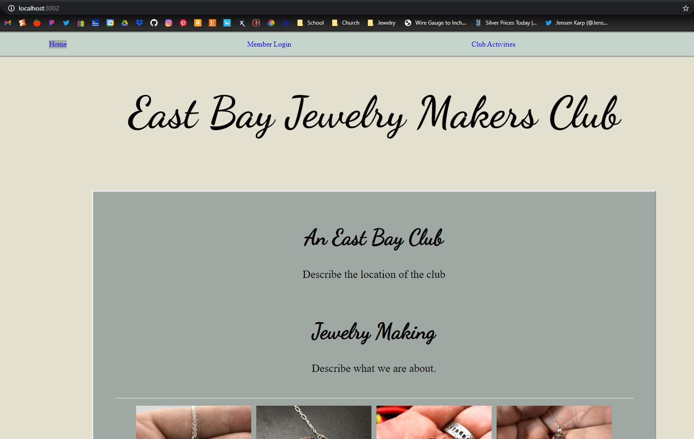
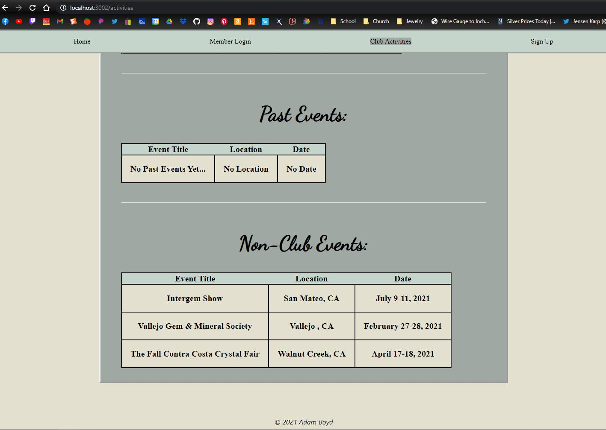
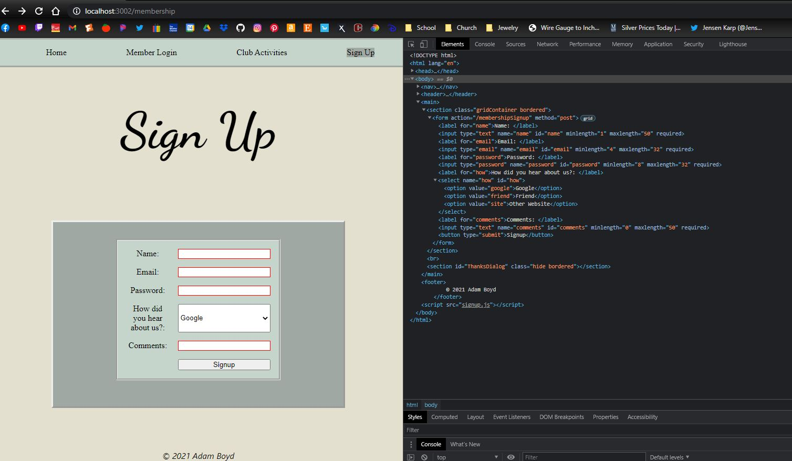
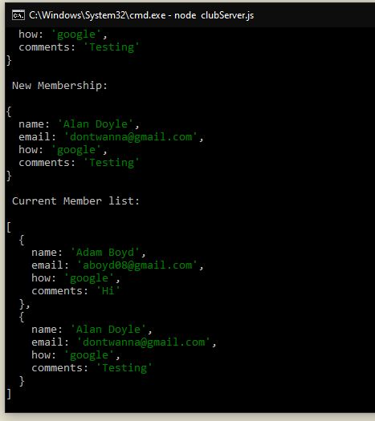
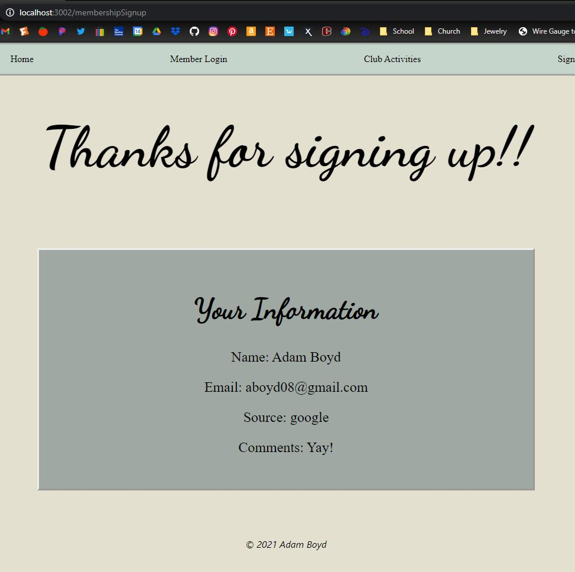
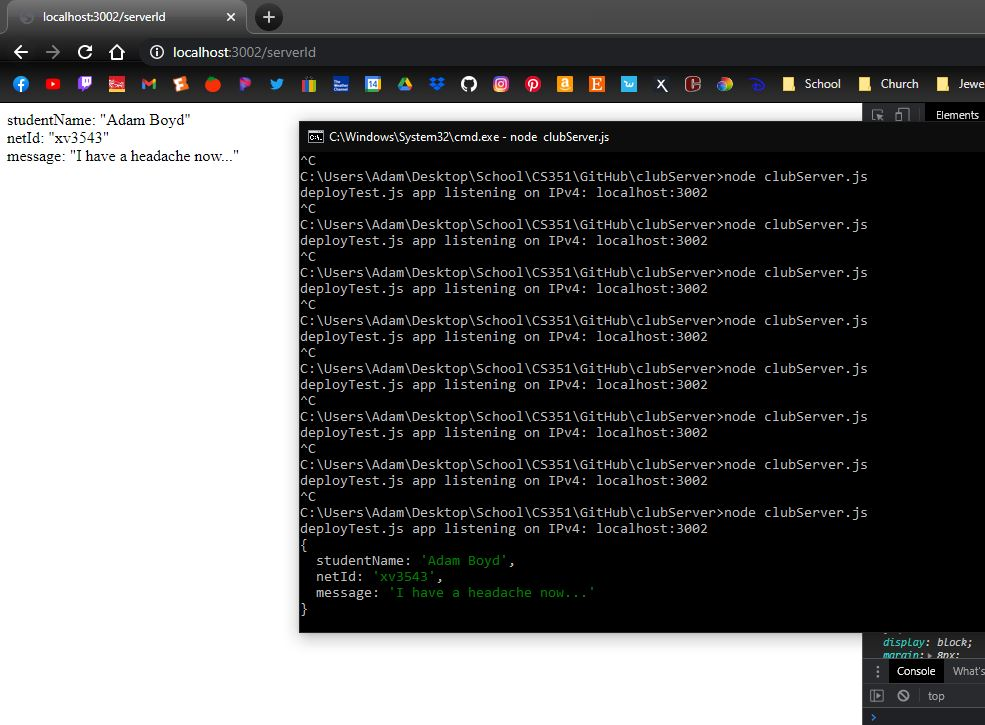

# Homework #9 Solution

**Adam Boyd**

**NetID: xv3543**

## Question 1

### (a)

### (b)

```html
<!DOCTYPE html>
<html lang="en">
    <head>
        <meta charset="utf-8">
        
        <link href="club.css" rel="stylesheet">
    </head>

<body>
    <nav>
        <ul>
            <li id="index"><a href="/">Home</a></li>
            <li id="login"><a href="login">Member Login</a></li>
            <li id="activities"><a href="activities">Club Activities</a></li>
            <li id="signup"><a href="membership">Sign Up</a></li>
        </ul>
    </nav>
    <header>
        
    </header>
    <main>
        
    </main>
    <footer>
        &copy; 2021 Adam Boyd
    </footer>
    <script src="{{scriptFile}}"></script>
</body>
</html>
```

### (c)



### (d)

```html



    <title>Login</title>
    <meta name="author" content="Adam Boyd">
    <meta name="description" content="This is the members login page for the East Bay Jewelry Makers Club">



    <h1>Login</h1>



    <section class="gridContainer bordered">
        <form action="" method="get" class="form-login">
            <label for="email">Email: </label>
            <input type="email" name="email" id="email" minlength="4" maxlength="32" required>
            <label for="password">Password: </label>
            <input type="password" name="password" id="password" minlength="8" maxlength="32" required>
            <input type="button" value="Login" id="click">
        </form>
    </section>
    <br>
    <section id="clickMessage" class="bordered hide"></section>

```

### (e)

### (f)

```html
<nav>
    <ul>
        <li id="index"><a href="/">Home</a></li>
        <li id="login"><a href="login">Member Login</a></li>
        <li id="activities"><a href="activities">Club Activities</a></li>
        <li id="signup"><a href="membership">Sign Up</a></li>
    </ul>
</nav>
```

## Question 2

### (a)

### (b)

```html



    <title>Club Activities</title>
    <meta name="author" content="Adam Boyd">
    <meta name="description" content="The club activites for the East Bay Jewelry Makers Club">



    <h1>Club Activities</h1>



    <h2>Future Events:</h2>
        <table id="events">
            <thead>
                <tr>
                    <th> Event Title </th>
                    <th> Location </th>
                    <th> Date </th>
                    <th> Time </th>
                </tr>
            </thead>
            <tbody>
                
                    <tr>
                        <td>{{event.title}}</td>
                        <td>{{event.location}}</td>
                        <td>{{event.date}}</td>
                        <td>{{event.time}}</td>
                    </tr>
                
            </tbody>
        </table>


        <br>
        <br>
        <hr>
        <br>

        <h2>Past Events:</h2>
        <table id="past">
            <thead>
                <tr>
                    <th> Event Title </th>
                    <th> Location </th>
                    <th> Date </th>
                </tr>
            </thead>
            <tbody>
                
                    <tr>
                        <td>{{event.title}}</td>
                        <td>{{event.location}}</td>
                        <td>{{event.date}}</td>
                    </tr>
                
            </tbody>
        </table>

        <br>
        <br>
        <hr>
        <br>

        <h2>Non-Club Events:</h2>
        <table id="nonClub">
            <thead>
                <tr>
                    <th> Event Title </th>
                    <th> Location </th>
                    <th> Date </th>
                </tr>
            </thead>
            <tbody>
                
                    <tr>
                        <td>{{event.title}}</td>
                        <td>{{event.location}}</td>
                        <td>{{event.date}}</td>
                    </tr>
                
            </tbody>
        </table>


```

### (c)



## Question 3

### (a)



### (b)



### (c)



```javascript
app.post('/membershipSignup', urlencodedParser, function(req, res) {
    console.log(req.body);
    delete req.body["password"];
    console.log(`\n New Membership: \n`);
    console.log(req.body);
    memberApplications.push(req.body);
    console.log(`\n Current Member list: \n`);
    console.log(memberApplications);
    res.render('thanks.njk', { info: req.body });
});
```

## Question 4

### (a)



### (b)