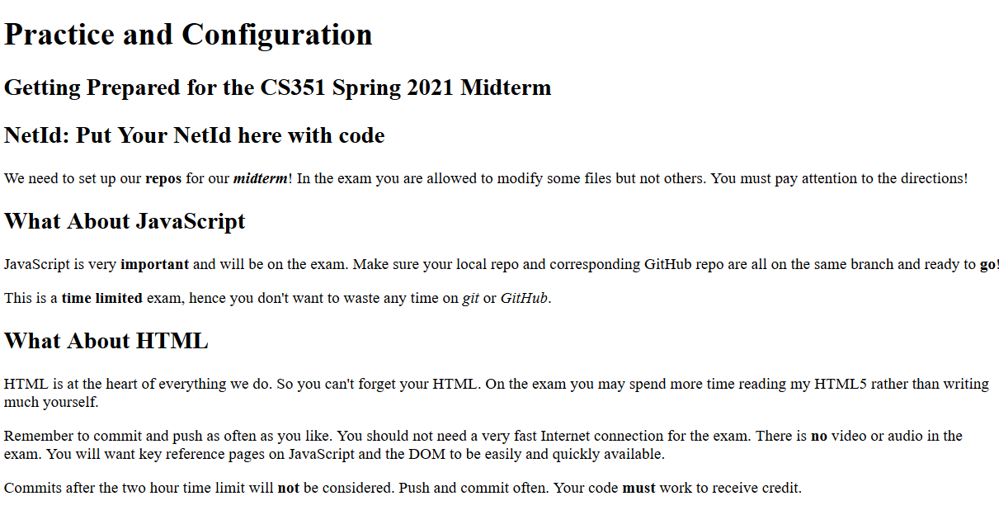
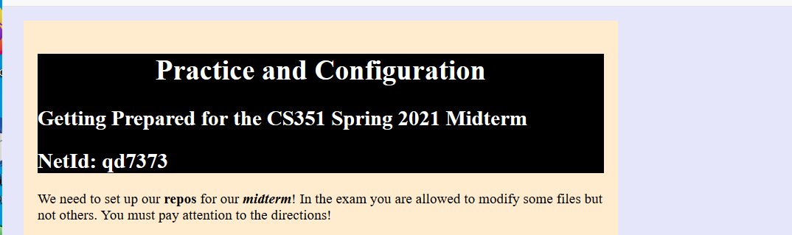
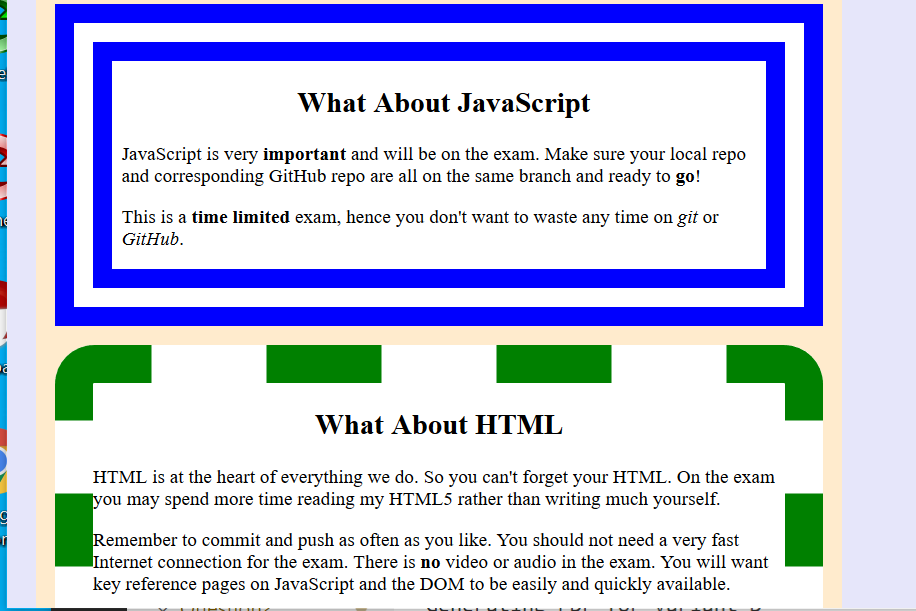

# Instructions: Practice (0 pts)

You are building an ugly web page for your web site development class. You are given the following files:

* An `index.html` file. **This cannot be modified.**
* A `practice.css` CSS file. You will be adding your styling to this file.
* A `practice.js` JavaScript file. You will be adding your code to this file

Prior to your work the HTML page will look like:

Afterwards it will look like this:

and this:

## (a) Update NetId with JavaScript (0 pts)

Using JavaScript in the `practice.js` file insert your NetId information in to the `` in the last `<h2>` element in the `<header>`.

## (b) Set some colors(0 pts)

Set overall background color to *lavender*, set main background color to "blanchedalmond". Set other colors on the elements and the text to approximately match my ugly mess. 

## (c) Set some widths and spacing (0 pts)

Set the CSS so as to limit the content to no wider than 40 "normal" characters.

## (d) Set some borders (0 pts)

Approximately match my borders.

## (e) Align some headings (0 pts)

I centered some headings. You can too!

