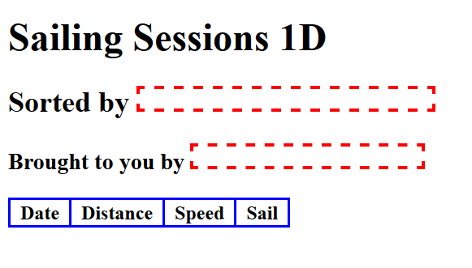
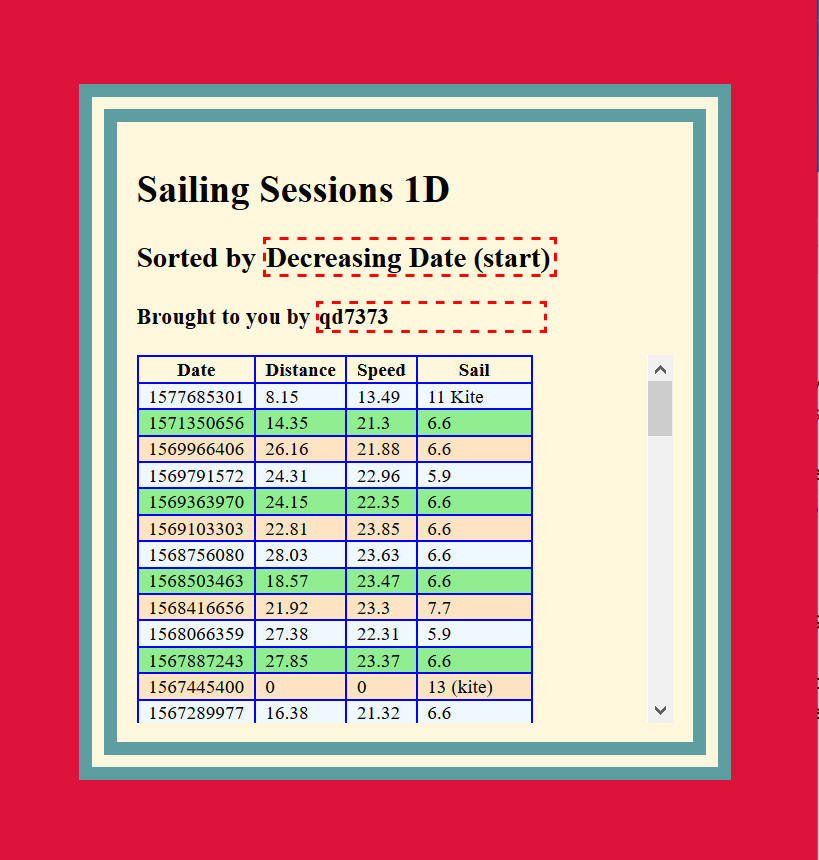

# Instructions: Question 1 Sailing Sessions (25 pts Variant D)

You are building a web page for a sailing club at CSUEB.
You are provided with the following files:

* An `index.html` file. **This cannot be modified.**

* A `windEvents2019.js` file containing data on all the elements in the periodic table. **This cannot be modified.**

* A `question1.css` CSS file. You will be adding styling to the top of this file (and leaving the rest alone). 

* A `question1.js` JavaScript file. This is empty except for some comments. All your JavaScript for this problem goes here. This file is referenced at the end of the `index.html` file.

You will update the `question1.css` and the `question1.js` files to provide the following functionality. Prior to your work the HTML page will look like:

## (a) CSS Styling (5 pts)

The example "finished" page is shown below.

* Set the `<body>` background color to: *crimson*

* Add "spacing" for the `<main>` element and its content (exact values are critical but there should be spacing like the screenshot.)

* Set background color for the `<main>` element to *cornsilk*

* Set the border as in the screenshot with the color name: *cadetblue*

**Notes**: You are **not** styling the table.

## (b) Add information via the DOM (5 pts)

* Using the DOM set the *Sorted By* information in the `<header>` to "Decreasing Date (start)" by modifying the contents of the appropriate `` element.

* Using the DOM set the *Brought to you by* information to your NetId by modifying the contents of the appropriate `` element.

## (c) Sort Sessions according to Criteria (5 pts)

Via JavaScript sort the sailing sessions in the *events* array by Sort by: "Decreasing Date (start)", do **not** be concerned about elements without values for this field. Do **not** be concerned with what this means, its just a *number*.

## (d) Create Table from Session Data (10 pts)

Based off the existing structure in the HTML file use the DOM to create the appropriately sorted (from part c) table of the sessions with the fields as given in the table header and shown in the screenshots. Use the *start* field for the *Date* and do not be concerned with the weird looking number we will practice with the JavaScript *Date* class another time.
