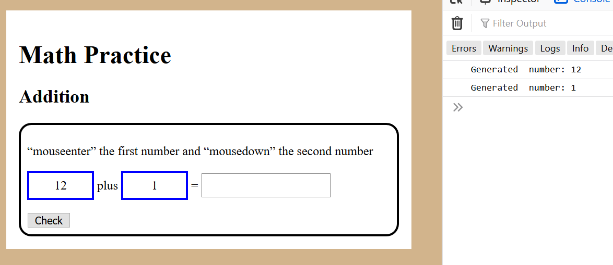
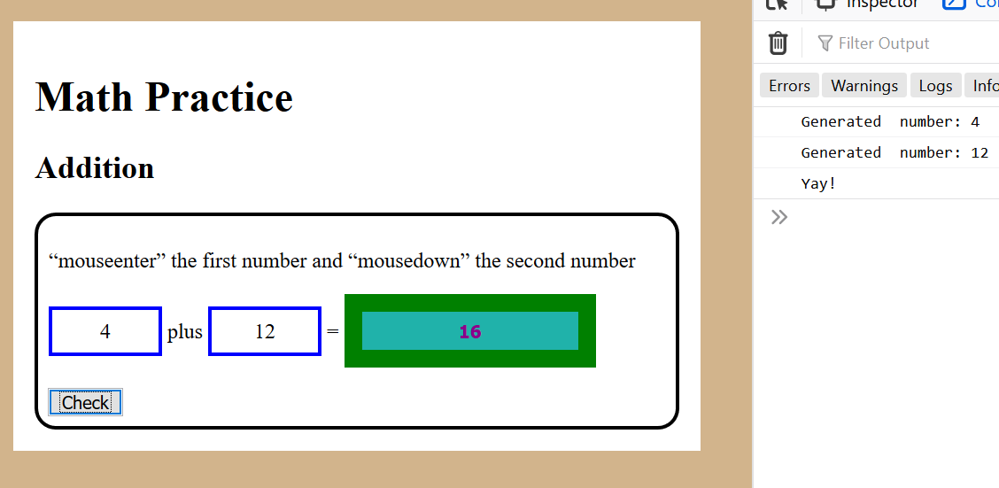
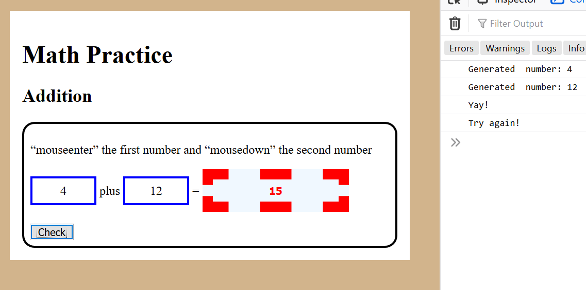

# Question 2 Lots of Events (25 pts Variant A)

You are starting to build a web Apps for an educational gaming company to provide practice in elementary mathematics.

You are provided with the following files:

* An `index.html` file. **This file cannot be modified.**

* A `question2.css` CSS file. **This file cannot be modified.**

* A `question2.js` JavaScript file. This is empty except for some comments and optional starter code that you can use or ignore. All your JavaScript for this problem goes here. This file is referenced at the end of the `index.html` file.

You will update the the `question2.js` files to provide the following functionality. 

## Instructions: Addition

### (a) Generate First Number on "mouseenter" event (5 pts)

When the user performs a "mouseenter" on the `` element containing the first number generate a new random between 0 and 12 and put it in this element. **Log** a message to the console. Note to generate the random number you can use the code `Math.round(12 * Math.random())` to get a random number.

### (b) Generate Second Number on "mousedown" event (5 pts)

When the user performs a "mousedown" on the `` element containing the second number generate a new random between 0 and 12 and put it in this element. **Log** a message to the console. Note to generate the random number you can use the code `Math.round(12 * Math.random())` to get a random number.

My window and console looks like the following after I trigger the events:

### (c) Check User Answer on Button Click (10 pts)

When the user clicks the "Check" button check the number that the user entered and see if it is the right answer for the math problem. If so give the `<input>` control the "happy" class and log "Yay!" to the console as shown in the figure below:

.

If the user has input the wrong answer give the `<input>` control the "sad" class and log "Try again!" to the console as shown in the figure below:

### (d) Clear Answer and CSS class when New Numbers Generated (5 pts)

Now, enhance the event handlers in part (a) and (b) to "clear" the answer and remove all classes from the `<input>` when a new number is generated, i.e., the screen should look like the original screenshot.
